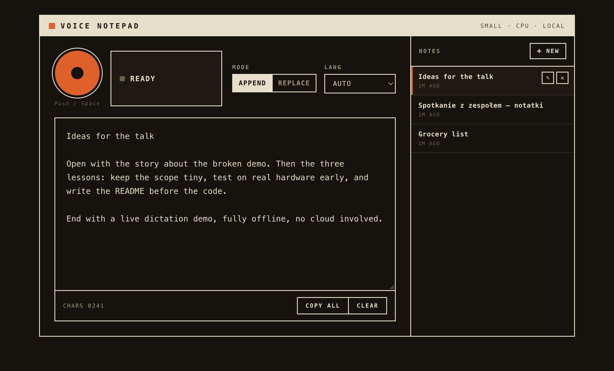

# Voice Notepad

**Private dictation that never leaves your computer.** Press record, speak Polish or English, and your
words appear in an editable notepad. Speech recognition runs locally with
[faster-whisper](https://github.com/SYSTRAN/faster-whisper) (OpenAI's Whisper model, optimized): no cloud,
no account, no subscription, no telemetry.



## Features

- **Fully local speech-to-text.** Audio is transcribed on your own machine. After a one-time model
  download, it works with no internet connection at all.
- **Polish and English.** Auto-detects the language, or pick one explicitly for better accuracy on short
  clips.
- **Notes library.** Every dictation lands in a note that autosaves as you type. Create, rename and delete
  notes from the sidebar; titles follow the first line until you rename them.
- **Append or replace.** Keep adding dictations to the current note, or replace its text with each one.
- **Keyboard-friendly.** Press <kbd>Space</kbd> to start and stop recording.
- **Plain files.** Each note is a small JSON file in `~/.voice-notepad/notes`, easy to back up or sync.
- **Light and dark theme**, following your system setting.
- **macOS app.** Optional one-click launcher and a Dock app, so you don't need a terminal day to day.

## Quick start

You need **Python 3.11+** and **[uv](https://docs.astral.sh/uv/)** (`brew install uv` on macOS, or see
the uv docs for other systems). No ffmpeg and no GPU required.

```bash
git clone https://github.com/adampolicht/voice-notepad.git
cd voice-notepad
uv sync
uv run python -m app
```

Then open **<http://127.0.0.1:8000>**, allow microphone access, and press the orange button (or
<kbd>Space</kbd>). Speak, press again to stop, and the text appears in a few seconds.

> **First run downloads the speech model** (about 485 MB for the default `small` model) into
> `~/.cache/huggingface`. The status shows *Loading model…* until it's ready. This is the only time the
> app uses the internet.

### macOS: launch without a terminal

- **Double-click `run.command`** in Finder. It starts the server if needed and opens the app in your
  default browser. Keep the Terminal window open while you use it; close it to stop.
- **Or build a Dock app:** run `./build-app.command` once. It compiles a small native
  `Voice Notepad.app` into `/Applications` (requires the Xcode Command Line Tools:
  `xcode-select --install`). Launch it like any app; **Quit** from the Dock also stops the server.
  Re-run the build if you move the project folder or change `PORT`.

### Linux and Windows

The app itself is plain Python plus a web page, so `uv run python -m app` should work on any system
where faster-whisper runs. It has been developed and tested on macOS (Apple Silicon); the `.command`
launchers are macOS-only.

## Using it

| Control | What it does |
|---|---|
| **Record button** / <kbd>Space</kbd> | Start and stop recording. Space works when no text field or button has focus. |
| **Mode: Append / Replace** | Append adds each dictation below the existing text; Replace overwrites the note's text. |
| **Lang: Auto / Polski / English** | Auto-detects by default. Choosing the language helps with short or mixed clips. |
| **Notes sidebar** | **+ New** starts a note. Hover a note for **rename** (✎) and **delete** (✕). |
| **Copy all / Clear** | Copy the whole note to the clipboard, or empty it. |

After each dictation the footer shows the detected language, the clip length and how long transcription
took.

## Choosing a model

Set `WHISPER_MODEL` in `.env` (see [Configuration](#configuration)). Bigger models are more accurate but
slower and need more memory. Sizes are approximate download sizes.

| Model | Download | Notes |
|---|---|---|
| `tiny` | ~75 MB | Very fast, weak for Polish |
| `base` | ~145 MB | Fast, weak for Polish |
| `small` | ~485 MB | **Default.** Good balance; fine for Polish and English |
| `medium` | ~1.5 GB | More accurate, noticeably slower on CPU |
| `large-v3-turbo` | ~1.6 GB | Near large-v3 accuracy, much faster than it |
| `large-v3` | ~3 GB | Most accurate, slowest; a GPU helps a lot |

On a machine with an NVIDIA GPU and CUDA, the app uses it automatically (`WHISPER_DEVICE=auto`).
Everywhere else it runs on the CPU with int8 quantization, which is fast enough for everyday dictation.

## Configuration

Copy the example file and edit it; every setting is optional.

```bash
cp .env.example .env
```

| Variable | Default | Description |
|---|---|---|
| `WHISPER_MODEL` | `small` | Model to load, see [Choosing a model](#choosing-a-model) |
| `WHISPER_DEVICE` | `auto` | `auto` (CUDA if available, else CPU), `cpu` or `cuda` |
| `WHISPER_COMPUTE_TYPE` | `auto` | `auto` (`float16` on GPU, `int8` on CPU), `int8`, `float16` or `float32` |
| `HOST` / `PORT` | `127.0.0.1` / `8000` | Where the server listens. Keep it on `127.0.0.1` |
| `DEFAULT_LANGUAGE` | `auto` | Language preselected in the UI until you pick one: `auto`, `pl` or `en` |
| `NOTES_DIR` | `~/.voice-notepad/notes` | Folder where notes are stored, one JSON file each |

Restart the app after changing `.env`.

## Privacy and security

- **Nothing leaves your machine.** Audio goes only to the local server, which writes it to a temporary
  file for transcription and deletes it right away. Recordings are never kept.
- **The only network request** is the one-time model download from Hugging Face. To guarantee the app
  stays offline afterwards, start it with `HF_HUB_OFFLINE=1 uv run python -m app`.
- **Local-only server.** It listens on `127.0.0.1`, so other devices on your network can't reach it, and
  it rejects requests with a foreign `Host` header, which blocks DNS-rebinding attacks from websites.
- **Your notes are plain files** in `NOTES_DIR`. Deleting a note in the app deletes its file.

To use the app on a machine without internet, download the model once elsewhere and copy
`~/.cache/huggingface` over.

## Troubleshooting

| Problem | Fix |
|---|---|
| Stuck on *Loading model…* | The first run is still downloading the model; watch the terminal. |
| *Model failed to load* banner | Check `WHISPER_MODEL` in `.env` for a typo, then restart. |
| *Microphone blocked* | Allow the mic for `127.0.0.1:8000` in your browser's site settings and reload. |
| Wrong language on short clips | Pick Polski or English instead of Auto. |
| Transcription is slow | Use a smaller model, or a GPU. The header shows the active model and device. |
| Port 8000 is already in use | Set another `PORT` in `.env` (and rebuild the Dock app if you use it). |

## How it works

```
Browser (app/static/index.html)              Local server (FastAPI, 127.0.0.1)
  MediaRecorder captures mic audio
  ─── POST /api/transcribe (webm) ───────▶   faster-whisper transcribes the clip
  ◀── { text, language, duration_s, ... } ─  (model loaded once at startup)
  Text is inserted into the note
  ─── PUT /api/notes/{id} (autosave) ────▶   Note written to NOTES_DIR as JSON
```

The whole UI is one HTML file with vanilla JavaScript: no build step and no frontend dependencies.

| Path | Purpose |
|---|---|
| `app/main.py` | FastAPI app: routes, startup model load, host check |
| `app/transcriber.py` | faster-whisper wrapper |
| `app/notes.py` | File-backed notes store |
| `app/config.py` | Settings from environment / `.env` |
| `app/__main__.py` | `python -m app` entry point |
| `app/static/index.html` | The single-file UI |
| `run.command`, `build-app.command`, `scripts/serve.sh` | macOS launchers |

## Development

```bash
uv sync --extra dev
uv run pytest                    # fast and offline: the model is mocked
RUN_INTEGRATION=1 uv run pytest  # also runs the real model against the audio fixtures
uv run ruff check && uv run ruff format --check
```

Design notes live in [`docs/DECISIONS.md`](docs/DECISIONS.md), and the original scope in
[`SPEC.md`](SPEC.md). Issues and pull requests are welcome; please keep changes small and include tests
where it makes sense.

## Ideas for later

- Global push-to-talk hotkey and pasting straight into the active app
- Live transcription while you speak
- Custom vocabulary for names and jargon
- Voice commands such as "new line" or "delete that"

## License

[MIT](LICENSE). Speech recognition by [faster-whisper](https://github.com/SYSTRAN/faster-whisper) and
OpenAI's [Whisper](https://github.com/openai/whisper) models.
